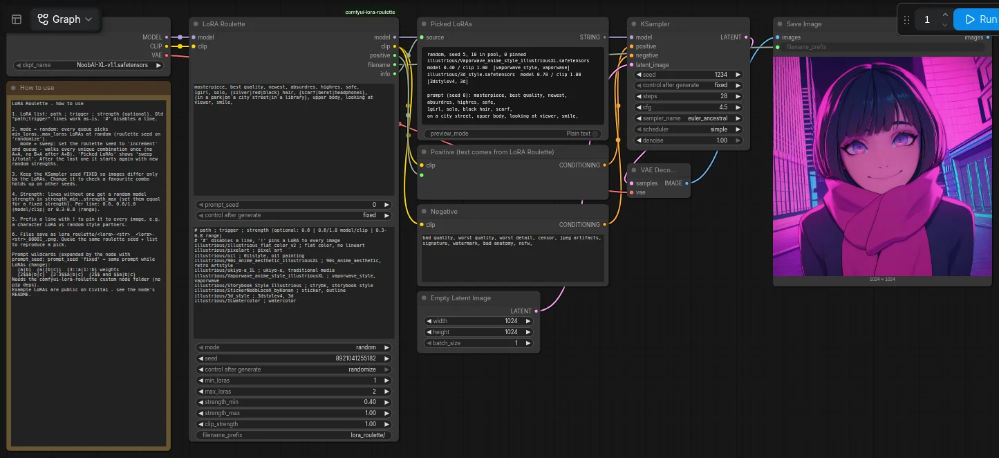
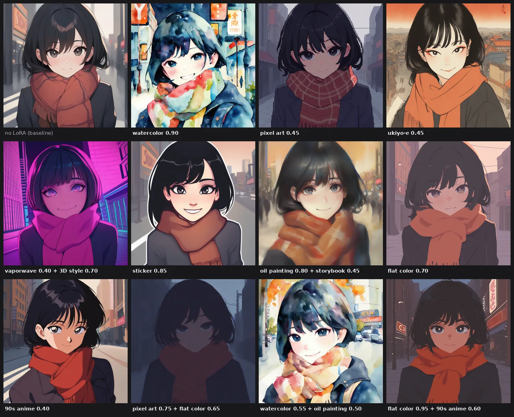
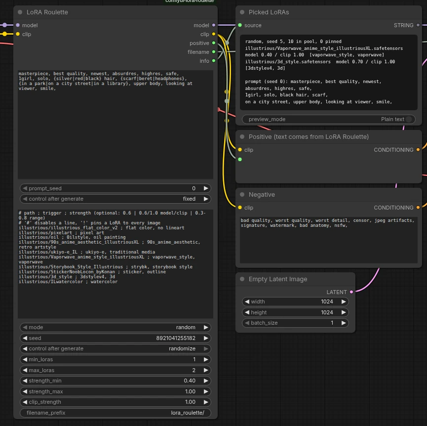

# LoRA Roulette

A single ComfyUI node for testing LoRAs in combination. It reads a text list of LoRAs, picks a combination (random, or a sweep through every unique combination), applies the LoRAs, appends their trigger words to the prompt, and builds a filename that names the combination.



## Install

Copy this folder into `ComfyUI/custom_nodes/` and restart ComfyUI. It has no pip dependencies. Then load `example_workflow.json`.

## Example workflow

`example_workflow.json` uses the NoobAI-XL v1.1 checkpoint and ten public concept/medium LoRAs from Civitai. Put the LoRAs in `models/loras/illustrious/`, or edit the paths in the list. Every LoRA gets a random strength between 0.4 and 1.0 (`strength_min` / `strength_max`).

| LoRA | file | trigger words used |
|---|---|---|
| [Flat Color - Style](https://civitai.com/models/1132089) | `illustrious_flat_color_v2.safetensors` | `flat color, no lineart` |
| [Pixel art style](https://civitai.com/models/1288970) | `pixelart.safetensors` | `pixel art` |
| [Oil Painting Style](https://civitai.com/models/1879856) | `oil.safetensors` | `0ilstyle, oil painting` |
| [90s anime aesthetic](https://civitai.com/models/1357076) | `90s_anime_aesthetic_illustriousXL.safetensors` | `90s_anime_aesthetic, retro artstyle` |
| [ukiyo-e Illustrious](https://civitai.com/models/1604951) | `ukiyo-e_IL.safetensors` | `ukiyo-e, traditional media` |
| [Vaporwave anime style](https://civitai.com/models/966987) | `Vaporwave_anime_style_illustriousXL.safetensors` | `vaporwave_style, vaporwave` |
| [Storybook Style](https://civitai.com/models/1519822) | `Storybook_Style_Illustrious.safetensors` | `strybk, storybook style` |
| [Easy Sticker](https://civitai.com/models/992518) | `StickerNoobLocon_byKonan.safetensors` | `sticker, outline` |
| [3D Style](https://civitai.com/models/1090269) | `3d_style.safetensors` | `3dstylev4, 3d` |
| [WatercolorStyle](https://civitai.com/models/963176) | `ILwatercolor.safetensors` | `watercolor` |

Each run picks one or two of these LoRAs. The KSampler seed and `prompt_seed` are fixed, so every image has the same subject and noise, and only the LoRAs change:



The node, with the info output showing what was picked and the expanded prompt:



## List format

```
# illustrious/old_experiment ; unused
illustrious\add_detail_xl.safetensors;add detail
cinematic_lighting ; cinematic lighting, rim light ; 0.7/1.0
illustrious/rainy_weather ; rain, wet ; 0.3-0.8
!illustrious/Princess_Luna-000007 ; princess luna (mlp) ; 0.9
```

The lines above, in order:

1. Disabled, because it starts with `#`. Comments must start the line; a `#` later in a line is read as part of the trigger.
2. The old `path;trigger` format, unchanged.
3. Fixed model/clip strength, given by bare filename.
4. Random model strength between 0.3 and 0.8.
5. Pinned with `!`, so it goes on every image on top of the random picks.

- `\` and `/` are interchangeable, and the `.safetensors` extension is optional. A bare filename matches in any subfolder if the name is unique.
- If a line doesn't match any file, the run stops with an error that lists the bad lines. This stops typos from quietly shrinking the pool.
- `None;...` lines are ignored. Setting `min_loras` to 0 gives you runs with no LoRA.

## Inputs

| input | meaning |
|---|---|
| `mode` | `random`: the seed picks `min_loras..max_loras` LoRAs. `sweep`: the seed is an index into every unique combination, so set the seed to *increment*. |
| `seed` | Sets both the pick and any random strengths. The same seed and list always give the same pick. |
| `strength_min/max` | Model-strength range for lines that don't set their own. Set them equal for a fixed strength. |
| `clip_strength` | CLIP strength for lines that don't set one with `model/clip`. |
| `prompt` | Positive prompt with wildcards (see below). The node expands it, not the browser. |
| `prompt_seed` | Seed for the wildcards, separate from the LoRA pick. Set it to *fixed* to keep the prompt while the LoRAs change. |

The `info` output (shown in "Picked LoRAs") lists each LoRA with its strengths. In sweep mode it also shows the position as `sweep i/total`.

## Prompt wildcards

The node expands these itself, seeded by `prompt_seed`, using the same inline syntax as comfyui-dynamicprompts:

| syntax | result |
|---|---|
| `{a\|b\|c}` | one option, picked evenly |
| `{a\|{b\|c}}` | nesting; each level picks evenly among its own options |
| `{3::a\|1::b}` | weighted pick; the default weight is 1 and 0 disables an option |
| `{2$$a\|b\|c}` | 2 distinct options, joined with `, ` |
| `{2-3$$a\|b\|c}`, `{-2$$...}`, `{2-$$...}` | 2-3 options; 1-2; 2 up to all |
| `{2$$ and $$a\|b\|c}` | custom separator |
| `//`, `/* */` | comments, which are removed |
| `\{ \} \|` | literal characters |

Wildcard files (`__name__`) aren't supported; `__name__` is left as plain text. If a `{` is never closed, the run stops with an error.

The expanded prompt is printed in the `info` output. Because the expansion depends only on `prompt_seed` and the template, the same seed always gives the same prompt.
